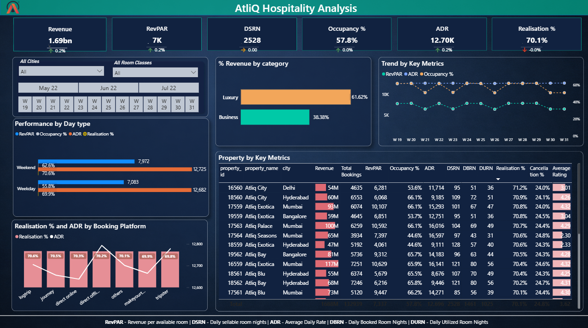
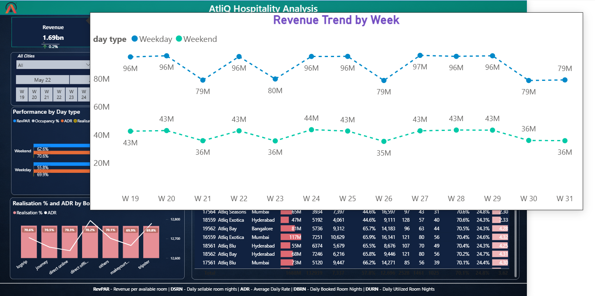
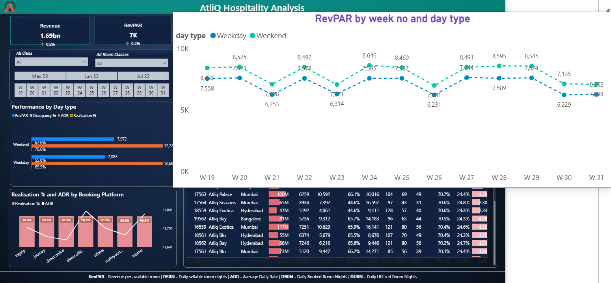
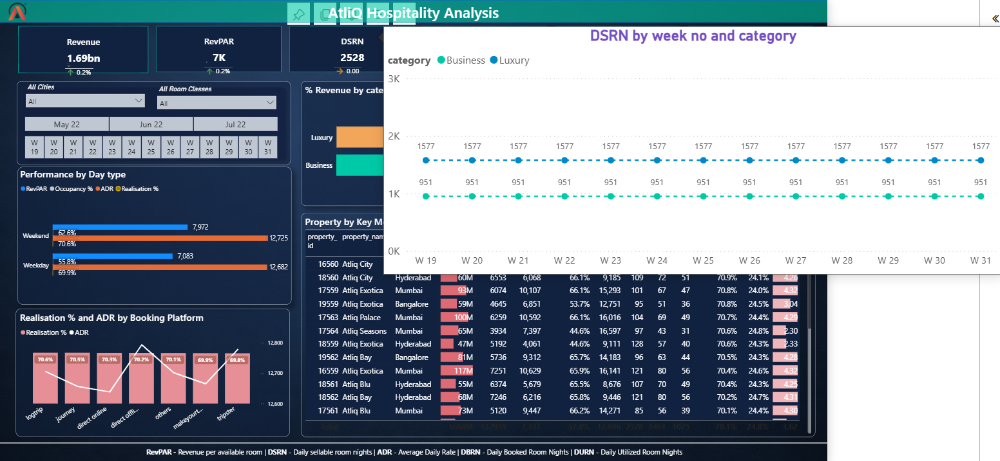
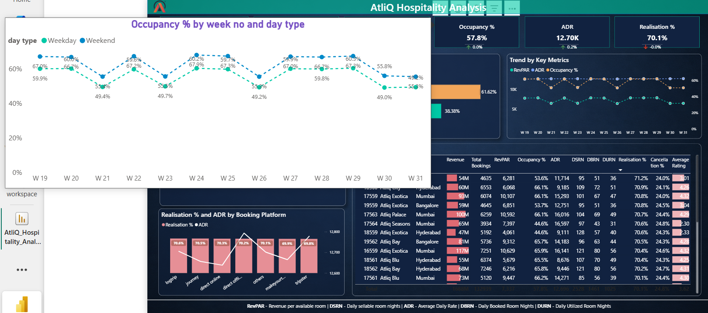
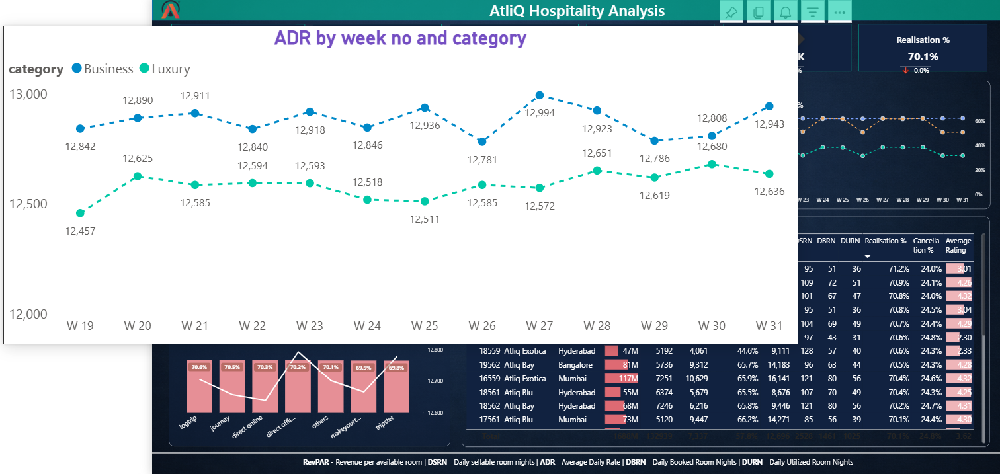
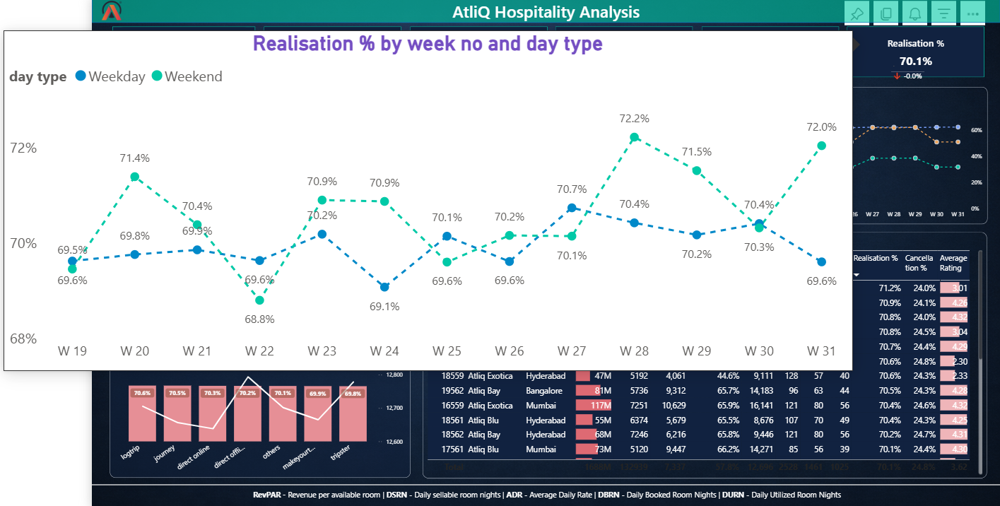

# AtliQ Grands — Revenue & Performance Analysis (Power BI)

🔗 **Live Power BI Dashboard:**  
https://app.powerbi.com/view?r=eyJrIjoiNjI3OGQ4N2ItMzhhNi00MTZiLThjMGQtYmEwNzlhYTc1ZGEzIiwidCI6ImM2ZTU0OWIzLTVmNDUtNDAzMi1hYWU5LWQ0MjQ0ZGM1YjJjNCJ9

🎯 Project Overview

This project analyzes AtliQ Grands’ booking and revenue performance across cities, room categories, booking platforms, and time. The objective was to:

Understand why revenue performance was uneven despite healthy bookings

Identify patterns in occupancy, pricing, and realization

Surface data-driven recommendations for revenue optimization

Build an interactive Power BI dashboard for stakeholders (Sales, Marketing, Finance, and Leadership)

This was completed as part of the Codebasics Resume Project Challenge.

Domain: Hospitality Analytics
Tool Used: Power BI (DAX, Data Modeling, Visualization, UX Design)
Time Analyzed: 3 months of booking data

🔍 What this project covers

✔ Multi-table data modeling using multiple CSV sources

✔ Star-schema design (Fact + Dimension tables)

✔ End-to-end data transformation and relationships

✔ Hospitality KPI framework

✔ Interactive slicers (City, Room Class, Time)

✔ Weekday vs Weekend performance analysis

✔ Booking platform comparison

✔ Property-level deep dive

📊 Key KPIs Analyzed

Revenue

RevPAR (Revenue per Available Room)

ADR (Average Daily Rate)

Occupancy %

Realisation %

DSRN (Daily Sellable Room Nights)

DBRN (Daily Booked Room Nights)

DURN (Daily Utilized Room Nights)

Cancellation %

Average Rating

📈 Key Business Insights (Quantitative & Data-Backed)

Occupancy varied widely (~44%–66%) → demand imbalance across properties

ADR remained fairly stable (~₹12.7K) → RevPAR changes were mainly driven by occupancy

Realisation % was consistent (~69.8–70.6%) across platforms, but ADR differed by channel

Luxury contributed ~61.6% of revenue vs Business 38.4%

Weekend Occupancy (62.6%) was higher than Weekday (55.8%), indicating stronger leisure demand

💡 Business Recommendations (Why these matter)
✔ Balance demand across properties

Low-occupancy hotels (44–50%) should lower prices slightly, while high-occupancy hotels (60%+) should protect rates — this improves overall RevPAR without deep discounting.

✔ Boost weekday demand

Corporate tie-ups + “workation” packages can stabilize midweek occupancy instead of relying purely on leisure travel.

✔ Channel steering

Stronger properties should push Direct Offline bookings, while weaker ones can leverage OTAs for visibility — improving profitability mix.

✔ Grow Business segment revenue

Long-stay discounts and corporate plans reduce dependence on Luxury rooms and smooth demand volatility.

🖼️ Dashboard Screenshots (Rendered in GitHub)
1️⃣ Revenue Trend by Week

2️⃣ RevPAR by Week & Day Type

3️⃣ DSRN by Week & Category

4️⃣ Occupancy by Week & Day Type

5️⃣ ADR by Week & Category

6️⃣ Realisation % by Week & Day Type

🛠️ Tools & Skills Demonstrated

Power BI: DAX, Measures, Slicers, Conditional Formatting

Data Modeling: Fact & Dimension tables

KPI Design: Hospitality metrics framework

Dashboard UX: Clean layout, hierarchy, color consistency

Business Storytelling: Insights tied to real decisions

🙌 Acknowledgments

Special thanks to Codebasics, Dhaval Patel, and Hemanand Vadivel for guiding this learning journey.

📬 Feedback Welcome!

If you have suggestions on visuals, DAX measures, or business logic — feel free to open an issue or comment.

Happy to iterate and improve! 🚀
